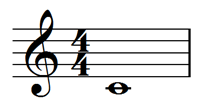
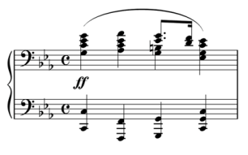

# MusicXML v3.0 Notes

## Purpose

Most of documentation is too sophisticated to see through without taking any notes. Therefore, I just write something that makes it easier to be understood for me and even for anyone who is intended to survey/learn what MusicXML trully is.

本文件是我在閱讀MusicXML文件的時候，用來當作備忘的筆記，並且加上一些自己的註解，將其閱讀心得保留下來以備不時之需。

## Overview
* [What's MusicXML?](#what_is_musicxml)
* [MusicXML Tutorial](#musicxml_tutorial)
	* ["Hello World" In MusicXML](#tut_hello_world_in_musicxml)
	* [The Structure Of MusicXML Files](#tut_the_struct_of_musicxml_files)
	* [Top-Level Document Elements](#tut_top_level_doc_elements)
	* [The Score Header Entity](#tut_the_score_header_entity)
	* [The MIDI-Compatible Part Of MusicXML](#tut_the_midi_compatible_part_of_musicxml)
	* [Notation Basics In MusicXML](#tut_notation_basics_in_musicxml)
	* [Chord Symbols And Diagrams](#tut_chord_symbs_and_diag)
	* [Tablature](#tut_tablature)
	* [Percussion](#tut_percussion)
	* [Compressed .MXL Files](#tut_compressed_mxl_files)


<h id="what_is_musicxml" />
## What's MusicXML?
[Webpage: What's MusicXML?](http://www.musicxml.com/UserManuals/MusicXML/MusicXML.htm#TutMusicXML2-1.htm%3FTocPath%3DMusicXML%25203.0%2520Tutorial%7C_____1)

MusicXML是一種用於 **攜帶/交換音樂資訊** 的標準、開放格式，主要動機是為了達成 
**在不同應用中分享/交換音樂相關的資料** 以及 
**建檔一份音樂資料（樂譜或表演等等）**。
使用MusicXML格式的檔案具備 **可讀性** 以及 **可編輯性**，讓音樂的檔案能夠被更快速的應用。

就像是MP3之於音樂聲訊一樣，MusicXML也成為了 **紀錄音樂資訊** 的標準格式。有了這個格式以後，每個人都能夠自己創作/編輯自己的音樂，並且快速分享給其他人。而至今有超過180個應用有支援MusciXML。

**註解：**

MusicXML將一般的樂譜或者是一段音樂創作，包成一個規格化的資料結構，旨在讓音樂資料能夠 **更妥善地被保存** 、 **更快速的重建且編輯** ，以及最重要的 **能夠讓電腦看得懂（意即可以使用程式設計的方法，去更改創作的資訊，達到互動式的電腦輔助音樂服務）** 。

<h id="musicxml_tutorial" />
## MusicXML Tutorial
[Webpage: MusicXML Tutorial](http://www.musicxml.com/UserManuals/MusicXML/MusicXML.htm#Tutorial.htm%3FTocPath%3DMusicXML%25203.0%2520Tutorial%7C_____0)

就像是MP3用於存音訊檔案一般，MusicXML的目的在於統一化全球的（原文寫西方的）音樂資訊存取格式，並且使音樂資訊能夠被 **彈性化運用** （能夠有個標準程序去解讀、修改、存入），其應用範圍跨及音樂演出、音樂教育、音樂資料庫等等。

此章節主要針對需要解析MusicXML檔案的軟體開發者。MusicXML有很多支援 **專業音樂軟體** 的特徵，縱然有許多細節需要細說，但就各人所需去了解部分章節即可。


<h id="tut_hello_world_in_musicxml" />
### "Hello World" In MusicXML
[Webpage: "Hello World" In MusicXML](http://www.musicxml.com/UserManuals/MusicXML/MusicXML.htm#TutMusicXML2-1.htm%3FTocPath%3DMusicXML%25203.0%2520Tutorial%7C_____1)

在各種程式語言中，被廣泛應用的入門程式：印出"Hello, world"，是源自於 Brian Kernighan 以及 Dennis Ritchie。這是學習如何編寫/建立/顯示一個指令的最小程式。在MusicXML中，一首只有"hello, world"歌詞的歌曲事實上卻沒有想像中的那麼簡單。因此，讓我們舉一個最簡單的例子：一個只有一個小節，4/4拍，且只有一顆中央C的高音樂譜：



此樂譜以MusicXML格式紀錄會長這樣：

```
<?xml version="1.0" encoding="UTF-8" standalone="no"?>
<!DOCTYPE score-partwise PUBLIC
	"-//Recordare//DTD MusicXML 3.0 Partwise//EN"
	"http://www.musicxml.org/dtds/partwise.dtd">
<score-partwise version="3.0">
	<part-list>
		<score-part id="P1">
			<part-name>Music</part-name>
		</score-part>
	</part-list>
	<part id="P1">
		<measure number="1">
			<attributes>
				<divisions>1</divisions>
				<key>
					<fifths>0</fifths>
				</key>
				<time>
					<beats>4</beats>
					<beat-type>4</beat-type>
				</time>
				<clef>
					<sign>G</sign>
					<line>2</line>
				</clef>
			</attributes>
			<note>
				<pitch>
					<step>C</step>
					<octave>4</octave>
				</pitch>
				<duration>4</duration>
				<type>whole</type>
			</note>
		</measure>
	</part>
</score-partwise>
```

針對每一個細節去做解釋：

```
<?xml version="1.0" encoding="UTF-8" standalone="no"?>
```

MusicXML是基於XML規定的一種格式，所以最上面需要加一行XML所需要的程式碼，以 `"UTF-8" v1.0` 將內部資訊編碼，`standalone`設定`no`表示我們要從外部去另外定義此文件。

```
<!DOCTYPE score-partwise PUBLIC
	"-//Recordare//DTD MusicXML 3.0 Partwise//EN"
	"http://www.musicxml.org/dtds/partwise.dtd">
```

這一行表示我們正在使用MusicXML，特別是 partwise 的樂譜（每一個小節都被包在一個`part`裡面）。上面的 `PUBLIC` 關鍵字是要引入DTD的位置，後面的URL只是某一個網址。大部份需要讀取MusicXML檔案的應用程式都必須下載一份 MusicXML DTDs 到自己的電腦上。直接使用XML parser而非直接使用網路去讀取。

如果應用程式需要驗證的是MusicXML XSD而非DTD的話，你也可以使用XML parser去達成。當寫成一份MusicXML的檔案時，加一行DOCTYPE使應用程式在解析一個MusicXML檔案的時候，更簡單直觀（直接顯示是基於DTD還是XSD的檔案）。

```
<score-partwise version="3.0">
```

這是最外層的標籤。相似功能的標籤有兩種：

1. `<score-partwise>`
	
	每一個元素都是由`part`所組成，而每一個`part`都是由小節所構成。
	
2. `<score-timewise>`

	每一個元素都是由小節所組成，而每一個小節都是由`part`所組成。

***不同的屬性，讓我們可以更輕易的分辨此MusicXML是使用哪一種規格，不過如果你是使用1.0的檔案的話就可以忽略這一行。***

```
	<part-list>
		<score-part id="P1">
			<part-name>Part 1</part-name>
		</score-part>
	</part-list>
```

無論是使用partwise還是timewise的樂譜，每一個檔案一定會有一個標籤在列舉出所有的內容（以本例就是列舉出在樂譜中所有的`part`）。這一行就是最精簡的`part-list`例子，只有一個音符。

```
	<part id="P1">
```

現在開始解讀文件中第一個（在本例也是唯一一個）的`part`，`id`屬性對應header裡面的`score-part`的`id`。

```
		<measure number="1">
```

我們從第一個`part`的第一個小節開始分析。

```
			<attributes>
```

在`attributes`中，含有我們解析音符跟音樂內容的重要資訊。（類似公式參數的概念）

```
				<divisions>1</divisions>
```

在MusicXML中的每一個音符都會有`duration`，而`divisions`代表每一顆四分音符所代表的`duration`單位。由於我們只有一顆音符，並不需要將四分音符切割成好幾個`divisions`，所以我們將`divisions`的值設定為1。

音樂上的延遲時間基本上會以一個fractions來表示，例如四分音符(quarter)或者是八分音符(eighth)，而MusicXML的`duration`也是如此。因為分母幾乎不需要去更動（每一個延遲時間都會以`divisions`為單位來分開表示），只有分子會需要跟每一個音符有關係。這跟MIDI表示一個音符長度的方法類似。

```
				<key>
					<fifths>0</fifths>
				</key>
```

`key`是用來表示調性的，`fifths`介於 [-7, 7] 之間：

1. +n：有n個升記號（D major是2）
2. - n：有n個降記號（F major是-1）

```
				<time>
					<beats>4</beats>
					<beat-type>4</beat-type>
				</time>
```

`beats`代表一小節有幾拍，`beat-type`指的是以幾分音符為一拍。（此例是4/4拍）

```
				<clef>
					<sign>G</sign>
					<line>2</line>
				</clef>
```

MusicXML支援多種格式的譜號，儘管很多譜號現在都已經不常見了。這裡代表的是”從下面數來第二條線的音高是G”。

```
			</attributes>
			<note>
				<pitch>
					<step>C</step>
					<octave>4</octave>
				</pitch>
```

`attributes`的部分結束以後，接著就是來描述內容中的音符：`note`。每一個音符都必須要有一個`pitch`，來記錄現在的音高（chroma + octave），此為C4，也就是中央C。值得提的就是在這裡有一個選擇性的值 `alter`，來表示升降(alteration)的，如果調性有預設的升降記號，縱使`key`那邊已經有定義了還是必須要加上。

```
				<duration>4</duration>
```

`divisions`是1，表示一個四分音符的長度是1個`division`，所以全音符是4。

```
				<type>whole</type>
```

The `<type>` element tells us that this is notated as a whole note. You could probably derive this from the `duration` in this case, but it is much easier to work with both notation and performance applications if the notation and performance data is represented separately.

In any event, the performance and notation data do not always match in practice. For example, if you want to better approximate a swing feel than the equal eighth notes notated in a jazz chart, you might use different duration values while the type remains an eighth note. Bach's music contains examples of shorthand notation where the actual note durations do not match the standard interpretation of the notes on the page, due to his use of a notational shorthand for certain rhythms.

The `duration` element should reflect the intended duration, not a longer or shorter duration specific to a certain performance. The `note` element has `attack` and `release` attributes that suggest ways to alter a note's start and stop times from the nominal duration indicated directly or indirectly by the score.

（保留原文，不確定完全理解）

`type`指的是音符的種類（全音符、二分音符、四分音符、八分音符等等），縱使從前面的`divisions`跟`duration`可以推敲出音符的種類，但是分開來紀錄還是有其好處：

1. 一般而言，表演的duration跟音符的duration通常有出入，而這裡的duration比較對應到表演的duration，而把樂譜上的詮釋保留給type去紀錄。

2. 有些樂譜/曲風（以爵士為例），雖然是兩個連續的八分音符，但是卻會有不一樣的節奏感，或者是有一些樂譜上的“簡寫”，隨著每個不同的作曲家，同樣的音符卻會有不同的呈現節奏。

總之，`duration`就是表示音符在演奏時確切的長度。除此之外，`note`還有`attack`跟`release`屬性，用來更精確的表示出敲鍵及放開的確切時間。

```
			</note>
		</measure>
	</part>
</score-partwise>
```

當然還有許多必須注意的小問題，比方說一個`pitch`只能夠含有一個`step`跟`octave`，為了要解決這個問題，通常會選擇用 **限定屬性間該有的順序** 來當作解決辦法。因此在MusicXML的格式當中，屬性間的排列順序相當重要。DTD就必須有一套明確的順序規定，但在入門中將不會著墨。

<h id="tut_the_struct_of_musicxml_files" />
### The Structure of MusicXML Files
[Webpage: The Structure of MusicXML Files](http://www.musicxml.com/UserManuals/MusicXML/MusicXML.htm#TutMusicXML3-1.htm%3FTocPath%3DMusicXML%25203.0%2520Tutorial%7C_____2)

#### Adapting Musical Scores to a Hierarchy

假設今天一段樂譜，是給兩個以上的人演奏的，此時樂譜就可以分成每一個人各自的部分，而每一個人要演奏的內容又是好幾個小節所構成。對應XML的格式，是將資料 **以上到下的層級概念** 去做表示 (hierachy)，但是從樂譜的特性上來看，並不是只有從屬關係，而是像一個 **晶格** 的架構。所以我們要怎麼用XML的方式去合理表現 (reconcile) 樂譜？究竟是應該要將同個人的演奏內容分開來表示，還是以同個小節多個人所要演奏的內容，來當作表現的格式？

答案其實是 **因應用而異** 。身為一位音樂認知專家和 [Humdrum](http://www.musiccog.ohio-state.edu/Humdrum/) 的發明人 David Huron 則建議我們必須能夠活用兩種的表現方式，並且可以流暢的在兩者之間轉換。

對應到上面所提到的 partwise/timewise，這也就是為什麼MusicXML會定義兩種不同結構的 DTDs，兩種各有自己的根 (root element)：

1. `<score-partwise>`

	資料列舉方式會以 **part** 做區隔 (primary) ，其包含多個 **小節** 資訊。

2. `<score-timewise>`

	資料列舉方式會以 **小節** 做區隔 (primary) ，其包含多個 **part** 資訊。
	
然而，如果是MusciXML XSD格式的檔案，就會同時包含這兩種根。

<br>
雖然要使用MusicXML的人必須熟悉兩種表現方式，但就像一般的軟體專案，為了讓所有相關的人都能夠專心於自己最關注的部分/領域，勢必是要一套能夠往返兩種表示方式的翻譯軟體。MusicXML當然有提供這項服務，分別是兩個XSLT的檔案 (stylesheet)：

1. `parttime.xsl`: from `<score-partwise>` to `<score-timewise>`

2. `timepart.xsl`: from `<score-timewise>` to `<score-partwise>`

<br>
一個應用程式在解析MusicXML的時候必須要可以選擇以哪一種表現方式當作單位，並且確認檔案符合格式（i.e. document type）。如果符合正確的根 (root element) 就直接解析，否則就用XSLT轉換成正確的格式以後再做解析，如果都不是上述的兩種格式，就停止程序並且回傳錯誤資訊。

當要將音樂資訊輸出成MusicXML檔案的時候，就簡單的就自己所需的格式去寫入，讀取的問題就丟給讀檔的應用吧！如果今天是 2-D 的資訊（不負責舉例：合唱譜），則兩種寫法的難度跟複雜程度是差不多的，這時候可以考慮使用 partwise 格式。大部份的MusicXML軟體都是使用 partwise ，所以如果兩者之間沒有很顯著的輸出難度差異，就可以考慮用 partwise 去降低其他應用在讀取時多了一個轉譯所消耗的時間。

<h id="tut_top_level_doc_elements" />
### Top-Level Document Elements
[Webpage: Top-Level Document Elements](http://www.musicxml.com/UserManuals/MusicXML/MusicXML.htm#TutMusicXML3-2.htm%3FTocPath%3DMusicXML%25203.0%2520Tutorial%7C_____3)

基本的MusicXML檔案結構在`score.mod`裡面有定義，以下是原始的定義內容：

```
<![ %partwise; [
<!ELEMENT score-partwise (%score-header;, part+)>
<!ELEMENT part (measure+)>
<!ELEMENT measure (%music-data;)>
]]>
<![ %timewise; [
<!ELEMENT score-timewise (%score-header;, measure+)>
<!ELEMENT measure (part+)>
<!ELEMENT part (%music-data;)>
]]>
```

`<![`跟`]]>`可以看成是`#ifdef`之類的條件判斷，所以上面的內容主要分成 `partwise.dtd` 以及 `timewise.dtd`。如果使用`partwise.dtd`，則`<score-parwise>`會被定義，反之則`<score-timewise>`被定義。

兩者之間的不同只有`part`跟`measure`的結構順序差別，所以可以從此看出`socore-partwise`是以多個`part`拼成，而每一個`part`涵蓋許多`measure`資訊；`score-timewise`反之。

不管是哪一種情形，較低階層的部分都包含音樂的資訊，代表著音樂在樂譜中真實的樣子，以下是相關定義：

```
<!ENTITY % music-data
	"(note | backup | forward | direction | attributes |
	harmony | figured-bass | print | sound | barline | 
	grouping | link | bookmark)*">
```

除此之外，每一個MusicXML檔案都會有一的`%score-header`，形式如下：

```
<!ENTITY % score-header
	"(work?, movement-number?, movement-title?,
	identification?, defaults?, credit*, part-list)">
```

We will now look at the score-header entity in more detail. If the example in the preceding "Hello World" section gave you enough information, you may want to skip ahead to the next section that starts describing music-data.

（還是無法理解這個header的細節，但至少可以看得出來它會列舉`part-list`，大概可以猜測是`score-partwise`）


<h id="tut_the_score_header_entity" />
### The Score Header Entity
[Webpage: The Score Header Entity](http://www.musicxml.com/UserManuals/MusicXML/MusicXML.htm#TutMusicXML3-3.htm%3FTocPath%3DMusicXML%25203.0%2520Tutorial%7C_____4)

The score header contains some basic metadata about a musical score, such as the title and composer. It also contains the part-list, which lists all the parts or instruments in a musical score.

As an example, take our MusicXML encoding of "Mut," the 22nd song from Franz Schubert's song cycle Winterreise. Here is a sample score header for that work:


```
<work>
	<work-number>D. 911</work-number>
	<work-title>Winterreise</work-title>
</work>

<movement-number>22</movement-number>
<movement-title>Mut</movement-title>

<identification>
	<creator type="composer">Franz Schubert</creator>
	<creator type="poet">Wilhelm Müller</creator>
	<rights>Copyright © 2001 Recordare LLC</rights>
	<encoding>
		<encoding-date>2002-02-16</encoding-date>
		<encoder>Michael Good</encoder>
		<software>Finale 2002 for Windows</software>
		<encoding-description>MusicXML 1.0 example</encoding-description>
	</encoding>
	<source>Based on Breitkopf &amp; Härtel edition of 1895</source>
</identification>

<part-list>
	<score-part id="P1">
		<part-name>Singstimme.</part-name>
	</score-part>
	<score-part id="P2">
		<part-name>Pianoforte.</part-name>
	</score-part>
</part-list>
```

一個score-header共有五個頂層的元素：

* work (optional)

	總之，就是很像大型專案的子專案號跟子專案名稱。如果想要顯示所有其他的子專案的話可以使用 `opus` 去聯結其他的MusicXML。
	
* movement-number (optional)

	這裡是表示這首曲子是24首裡面的第22首。

* movement-title (optional)

	曲子的名稱。

* identification (optional)

	紀錄作者（包含音樂的作者以及編碼的作者/軟體）。

* part-list (required)


只有 part-list 是必要的，所以來看它的架構：

```
<part-list>
	<score-part id="P1">
		<part-name>Singstimme.</part-name>
	</score-part>
	<score-part id="P2">
		<part-name>Pianoforte.</part-name>
	</score-part>
</part-list>
```

part-list 就像是一種“清單”，在這裡不會詳細顯示出每一個 part 裡面所真實涵有的音樂資訊，詳細的會在更底下才會敘述（以對應`id`的方式），`id`的賦值一般就是約定成俗的`"P1"`、`"P2"`，當然也可以自己定義，只要確保`id`不能重複就好。

In addition to the part-name, there are many optional elements that can be included in a score-part:

* An identification element, helpful if individual parts come from different sources.
* A part-abbreviation element. Often, you will use the part-name for the name used at the start of the score, and the part-abbreviation for the abbreviated name used in succeeding systems.
* A group element, used when different parts can be used for different purposes. In MuseData, for instance, there will often be different parts used for a printed score, a printed part, a MIDI sound file, or for data analysis.
* One or more score-instrument elements, used to describe instrument sounds and virtual instrument settings, as well as to define multiple instruments within a score-part. This element serves as a reference point for MIDI instrument changes.
* One or more midi-device elements for identifying the MIDI devices or ports that are being used in a multi-port configuration. Multiple devices let you get beyond MIDI's 16-channel barrier.
* One or more midi-instrument elements, specifying the initial MIDI setup for each score-instrument within a part.


<h id="tut_the_midi_compatible_part_of_musicxml" />
### The MIDI-Compatible Part of MusicXML
[Webpage: The MIDI-Compatible Part of MusicXML](http://www.musicxml.com/UserManuals/MusicXML/MusicXML.htm#TutMusicXML4-1.htm%3FTocPath%3DMusicXML%25203.0%2520Tutorial%7C_____5)

一個MusicXML檔案主要有兩種類別的資料：

1. 描述這個音樂 **聽起來** 如何，用來產生MIDI檔

2. 描述這個音樂 **看起來** 如何，用來產生音樂編輯軟體 (e.g. Finale) 的GUI

一般來說，會希望檔案中的資訊越精確越好。只有音樂 **聽起來** 的資訊是一定要在檔案中的，所以先從音樂的元素來做介紹：

以下是 Gabriel Fauré 的 "Après un rêve" 前四小節：


#### Attributes

`attributes` 帶有許多資訊：

* time signature

* key signature

* transpositions

* clefs

在此例中，`attributes`的內部被編成這樣：

```
<attributes>
	<divisions>24</divisions>
	<key>
		<fifths>-3</fifths>
		<mode>minor</mode>
	</key>
	<time>
		<beats>3</beats>
		<beat-type>4</beat-type>
	</time>
</attributes>
```

#### Divisions

音符一般都是用 **分數 (fraction)** 的方式來敘述：

* 全音符 (whole notes)
* 二分音符 (half notes)
* 四分音符 (quarter notes)
* 八分音符 (eighth note)

因此定義`divisions`來當作 **一個四分音符長度的量化標準** ，就可以將其他的音符都用同一種量尺來描述。

`divisions`在MusicXML中是可以中途改變其值的，但是一般來說大部份的軟體在定義`divisions`的時候就會取最適當的數字（意即所有音符的長度都可以用整數表示，也就是取音符長度之中的最小公倍數）。在範例中的`divisions`設定`24`，讓 八分音符三連音 (triplet eighth notes) 以`8`為長度、而 十六分音符 (sixteenth notes) 以`6`為長度。

#### Key

`fifths`表示幾個升記號（正數）或幾個降記號（負數），`mode`代表大小調 (`major`|`minor`)。

#### Time

`beats`表示一個小節的拍數，`beat-type`表示以幾分音符為一拍。

#### Transpose

如果需要轉調的話，則可以在`attributes`加上這個屬性（一種首調的概念），分為三個屬性值：

* `diatonic` (optional): 八度的位置的位移
* `chromatic` (optional): 增減了幾個key (半音)
* `octave-change` (optional): 移動幾個八度
*  `double` (optional): 移動幾個十五度（兩個八度）

假設小喇叭要將 C3 演奏成 Bb2，則可以這樣表示：

```
	<transpose>
		<diatonic>-1</diatonic>
		<chromatic>-2</chromatic>
	</transpose>
```

* 八度的位置往下掉一個，所以`diatonic`為`-1`
* 下降一個全音，所以`chromatic`為`-2`

`diatonic`屬性有沒有，對於產生MIDI檔沒有影響，主要是在產生樂譜上比較方便且準確。（比方說合唱譜男高音，會使用高音譜記號但是會有一個8表示全部降八度）

#### Pitch

`pitch`/`duration`/`ties`/`lyrics`都會包含在`note`裡面，以下是樂譜中第一行第三小節的降E：

```
<note>
	<pitch>
		<step>E</step>
		<alter>-1</alter>
		<octave>5</octave>
	</pitch>
	<duration>24</duration>
	<tie type="start"/>
	<lyric>
		<syllabic>end</syllabic>
		<text>meil</text>
		<extend/>
	</lyric>
</note>
```

MIDI檔中，每一個音高都是用一個數字來表示，而MusicXML則是分成三個部分：音調、升降、以及八度。這裡必須注意的是，此表示是表示 **聽起來** 而非 **看起來**，換句話說，就算譜上面沒有臨時記號 (accidental)，都必須要記得隨著調性做升降。`alter`屬性可以是整數也可以是浮點數，例如`1`表示升、`-1`表示降、`2`表示雙升、`-0.5`表示半降，但不是所有軟體都支援這類變化。

如果是休息記號，則如以下的方式表示：

```
<note>
	<rest/>
	<duration>72</duration>
</note>
```

休息三拍，在此例子就是全休止符。

#### Duration

音符的長度，以`divisions`為單位。

#### Tied Notes

連結線，`<tie type="start"/>`和`<tie type="stop"/>`是一對的，表示連結線的起始與結束。

#### Chords

音樂以音符來表示，而走向就由`duration`來驅動 (music counter)。但今天如果像是第二行第一小節的第一拍，鋼琴部分必須要三個音同時在第一拍出現，此時就需要`<chord/>`。

在本例子的第二行，沒有比八分音符更加複雜的節奏出現，因此`divisions`設定是`2`，所以第一拍的和弦就可以這樣表示：

```
<note>
	<pitch>
		<step>C</step>
		<octave>4</octave>
	</pitch>
	<duration>1</duration>
</note>

<note>
	<chord/>
	<pitch>
		<step>E</step>
		<alter>-1</alter>
		<octave>4</octave>
	</pitch>
	<duration>1</duration>
</note>

<note>
	<chord/>
	<pitch>
		<step>G</step>
		<octave>4</octave>
	</pitch>
	<duration>1</duration>
</note>
```

但如果今天和弦上的音長度不一，會建議使用 multi-part music 而非 chord，真的非得用的話，最長的那顆音必須在最上面。

#### Lyrics

TBC

#### Multi-Part Music

有些單音樂器（喇叭、長笛、人聲）的樂譜就可以很簡單的一顆音一顆音延續下去，當然也有一些多音樂器（鋼琴）就沒這麼單純，以下的例子是 Frederic Chopin's Prelude, Op. 28, No. 20 的第一小節：



如同前面所說的，音樂的走向會有一個計數器 (music counter)，如果想要表示第三拍的右手，勢必需要對於計數器有更大的控制能力：也就是`backup`跟`forward`。

假設此例的`divisions`是`4`，將第三拍的右手分為兩個部分。舉例來說，Finale可能會將 G 跟 還原B 當成放在音軌2，其他的放在音軌1。音軌2的表示方法就會如下：

```
<backup>
	<duration>16</duration>
</backup>

<forward>
	<duration>8</duration>
</forward>

<note>
	<pitch>
		<step>G</step>
		<octave>3</octave>
	</pitch>
	<duration>4</duration>
</note>

<note>
	<chord/>
	<pitch>
		<step>B</step>
		<octave>3</octave>
	</pitch>
	<duration>4</duration>
</note>

<forward>
	<duration>4</duration>
</forward>
```

`backup`相當於倒轉，倒轉`16`個`duration`就是倒退兩拍，也就是此小節的頭；`forward`可以想成是休止符，所以下面的`forward`就是休息兩拍；後面接上 G 跟 還原B一拍，最後再休息一拍，完成音軌2的描述。

也可以寫成：

```
<note>
	<pitch>
		<step>G</step>
		<octave>3</octave>
	</pitch>
	<duration>4</duration>
</note>

<note>
	<chord/>
	<pitch>
		<step>B</step>
		<octave>3</octave>
	</pitch>
	<duration>4</duration>
</note>

<backup>
	<duration>4</duration>
</backup>

<note>
	<pitch>
		<step>E</step>
		<alter>-1</alter>
		<octave>4</octave>
	</pitch>
	<duration>3</duration>
</note>

<note>
	<chord/>
	<pitch>
		<step>G</step>
		<octave>4</octave>
	</pitch>
	<duration>3</duration>
</note>
	
<note>
	<pitch>
		<step>D</step>
		<octave>4</octave>
	</pitch>
	<duration>1</duration>
</note>

<note>
	<chord/>
	<pitch>
		<step>F</step>
		<octave>4</octave>
	</pitch>
	<duration>1</duration>
</note>
```

先 G 還原B持續一拍，然後`backup`一拍（回到G 還原B開始的位置），接上一個3/4拍的 降E G 跟 1/4拍的 D F。等效於分兩組：

* G 跟 還原B 持續一拍
* 降E 跟 G 持續3/4拍以後接著 D 跟 F

如此也可以實現第一行第三拍的右手。

<h id="tut_notation_basics_in_musicxml" />
### Notation Basics In MusicXML
[Webpage: Notation Basics In MusicXML](http://www.musicxml.com/UserManuals/MusicXML/MusicXML.htm#TutMusicXML5-1.htm%3FTocPath%3DMusicXML%25203.0%2520Tutorial%7C_____6)

<h id="tut_chord_symbs_and_diag" />
### Chord Symbols And Diagrams
[Webpage: Chord Symbols And Diagrams](http://www.musicxml.com/UserManuals/MusicXML/MusicXML.htm#TutMusicXML6-1.htm%3FTocPath%3DMusicXML%25203.0%2520Tutorial%7C_____7)

<h id="tut_tablature" />
### Tablature
[Webpage: Tablature](http://www.musicxml.com/UserManuals/MusicXML/MusicXML.htm#TutMusicXML7-1.htm%3FTocPath%3DMusicXML%25203.0%2520Tutorial%7C_____8)

<h id="tut_percussion" />
### Percussion
[Webpage: Percussion](http://www.musicxml.com/UserManuals/MusicXML/MusicXML.htm#TutMusicXML8-1.htm%3FTocPath%3DMusicXML%25203.0%2520Tutorial%7C_____9)

<h id="tut_compressed_mxl_files" />
### Compressed .MXL Files
[Webpage: Compressed .MXL Files](http://www.musicxml.com/UserManuals/MusicXML/MusicXML.htm#TutMusicXML9-1.htm%3FTocPath%3DMusicXML%25203.0%2520Tutorial%7C_____10)

## Reference
[MusicXML documentation](http://www.musicxml.com/UserManuals/MusicXML/MusicXML.htm#Contents.htm%3FTocPath%3D_____1])
