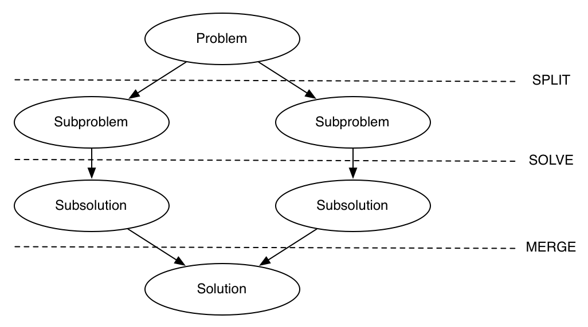
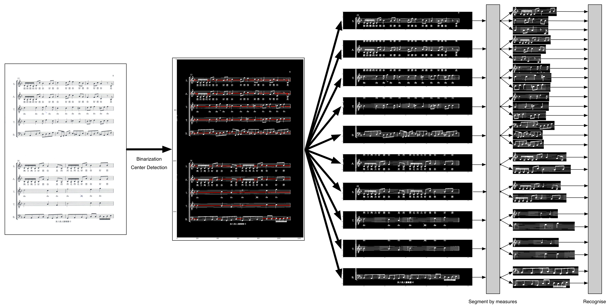

# Automatic Scores Recognition with Divide and Conquer 分治法概念的自動樂譜辨識

[hackpad link: Automatic Scores Recognition with Divide and Conquer](https://hackpad.com/Automatic-Scores-Recognition-with-Divide-and-Conquer-6Yjkp8vm3KS)

## Abstract
TBC

## Table of Contents
1. [Introduction](#introduction)
	- [Motivation](#motivation)
	- [The Goal](#the-goal)
	- [System Design](#system-design)
	- [Divide and Conquer](#devide-and-conquer)
		- [What is divide and conquer?](#what-is-divide-and-conquer)
		- [The way dividing and conquering](#the-way-dividing-and-conquering)
		- [Advantages](#advantages)
	- [Applications](#applications)
	- [Design of Dissertation](#design-of-dessertation)

2. [Review of Related Research](#review-of-related-research)
3. [Technical Background](#technical-background)
4. [Software Framework](#software-framework)
5. [Results](#result)
6. [Conclusions](#conclusions)
7. [References](#references)

## 1. Introduction
### 1-1. Motivation
In the era full of high-tech tools, most of tasks can be done by computers: people write articles with computers; people draw diagrams with computers; people, of course, design programs with computers. Among various instances we use computers for, one of them is music composition. For purposes of storing and visualising musicians' creation, the score, which contains lots of music information showing how a piece of melody should be played, has been widely used for hundreds of years. However, the score was designed for human beings rather than computers, most of scores are stored as images, which are just sets of pixels and mean nothing for computers. As a result, a field, namely Optical Music Recognition (OMR), discussing methods for letting computers recognize all stuffs illustrated in an image was emphasised.

### 1-2. The Goal
The project aims at developing a framework that enables people to analyze scores programmatically. 

### 1-3. System Design
TBC

### 1-4. Divide and Conquer
#### 1-4-1. What is divide and conquer?

The figure shows the main concepts of "divide and conquer".  D&C (Divide and Conquer) is an algorithm design paradigm that breaks a complex problem into a couple of relatively simple subproblems, called "divide", then solves them respectively, called "conquer" instead of dealing with it directly. Before conquering, the problem will be divided recursively until it is simple enough to be processed. Finally, the solutions to the subproblems will be merged as those to the original problem.

#### 1-4-2. The way dividing and conquering
In a score, a song is composed of staves, a staff contains measures, which can be regarded as a smallest unit to be recognised. Due to its hierarchical structure, scores recognition is a suitable problem that can be solved with D&C algorithm.

In the system, a measure is determined as the simplest subproblem to be solved. After binarization, staves are extracted from the binary matrix, and all measures within each staff are extracted respectively. Subsequently, the extracted measures are processed with the recognition system.

#### 1-4-3. Advantages
The main concept of D&C is to simplify problems such that a difficult problem can be turned into many tiny problems. In this way, it brings us some advantages:

- Difficulty of problems

	Due to characteristics of D&C, all problems that can be accurately split are expected to be solved. For this project, if the function detecting staves and measures is reliable, then we can analyze arbitrarily complicated scores.

- Independence of subproblems
	
	A score contains not just all information of the creation, but other noisy things such as metadata of the song, lyrics, and printed defects. By partitioning the original images into pieces of sub-image that contains only one measure, noisy information can be decreased and interference between staves is eliminated. Therefore, the detection tasks are independent with different staves.
	
- Recognition system development

	With single measure images as development set, the recognition system needs to be focused only on how to find symbols in a measure, and the conquer function is simpler.
	
- Parallelism

	Nowadays, a processor usually has multiple cores, and lots of computational tasks are implemented to be executed with parallel programs. In D&C algorithm, the functions solving split subproblems are identically designed. With high independency and similar operations between subproblems, it is a good strategy to process them simultaneously. In other word, the original problem is suitable to be solved with SIMD (Single-Instruction-Multiple-Data) parallel programs.

### 1-5. Applications
TBC

### 1-6. Design of Dissertation
TBC

## 2. Review of Related Research
### 2-1. Binarization

In recognition of printed scores, it is redundant to consider color vector, namely a 3-D (R/G/B) or 4-D vector (R/G/B/A), and all methods only require gray-scaled images as the input. In addition, an intuitive approach for reducing input space (generally from 0 to 255 for gray-scaled images) proposed by most of related fields is to transform a 8-bit integer to a binary value. In recognition with human brains, people always determine if each pixel is background (white) or foreground (black) in advance, and it is also known as background/foreground classification in the field of page segmentation.

In Pinto's research [1], it provides overview and quantitive analysis for scores binarization, and all proposed methods are invented based on different considerations. There are several approach categorized as:

1. global threshold

	Global thrsholding brings advantages of fast computation and simple implementation, it binarizes images by using only one well-tuned value applied to all pixels globally. The threshold is obtained with various aspects:
	- intensity based by maximizing the variance between classes
	- entropy based
	- preservation of edge information
	- similarity based between raw image and its binarized image

2. local threshold

	Local thresholding is an adaptive approach that considers the inconsistency of intensity when the document is transformed into digital form. A common situation is the digitalization of regions close to the bound of a page in a book, the image might show a gradient-like difference in terms of the average intensity from the region far from the book spine to that close to the book spine. Under the situation, global thresholding might lose some of contents caused by inconsistency of intensity, and local thresholding is consequently suggested for dealing with such variable. Generally, local thresholding is to assigning different threshold at different pixels with their nearby neighbors (local information). In practice, some methods simplify the pixel-wise threshold as column-wise threshold, which is varied only by columns. The implementations of local thresholding contain two steps in common: dividing the image into a couple of blocks such as vertical slices and then figuring out a suitable value respectively.

### 2-2. Segmentation

For all OMR implementations, the segmentation stage is essential. In the segmentation stage, a set of smaller images is obtained by a series of techniques for further recognition. Generally, the results of this stage do affect the final recognition results very much because the recognition suggested before is sensitive to how "well" the image has been segmented.

In OMR research, staves, which are formed by five parallel and equidistant lines, are the most important components because all music notations and symbols are placed on them and the relative positions strongly indicates the pitches at every beat. As a result, almost all methods detect the staves as the first segmentation operation. The general approach can be simply separatearated into two parts: 1) staffsegments detection, and 2) staffsegments linking. For staffsegments detection, the system marks all regions that are possibly parts of stafflines; For staffsegments linking, the system has to cluster all staffsegments as multiple groups of five-equidistant lines which can be regarded as staves. 

#### Staff Detection

The first approch is based on horizontal projection [2, 4], as known as y-projection, it sums each row elements as a column vector and the characteristics of staves should yield a relatively higher local peaks to be found. Randriamahefa at el. [2] improves the robustness of the algorithm by partitioning the original image into several vertical slices and marking all possible regions with horizontal projection, the improvement deals with the problem when the staves are not perfectly horizontal, and the problem always needs to be considered. In addition to horizontal projection, the other approach is run-length coding (RLC) [3, 5, 7, 8, 9, 10]. RLC is a encoding method that provides another representation of a sequence of data, especially suitable on the data where the size of value set is small such as binary values. Most of methods using RLC always compute staff profile in advance [4, 5, 7, 8, 9, 10], namely compute stafflines width and stafflines spacing, by making histograms of black and white runs and finding the most frequent occurrence (black-length and white-length refer to width and spacing) respectively. With the method suggested by Reed & Parker [3], the system detects staff samples without using staff profile, but only detects the groups (five black runs and four white runs) that can be checked if they meet the tolerance of "equidistant". Some methods like [5, 8] check if each black runs and its vertically adjacent white runs show the characteristic of equidistant. The method of Rossant & Bloch [7] uses similarity metric, they define a mask filter, which is characterized as a perfect staffsegment, and detect staffsegments with sliding window and image filtering then find local maxima. They also consider the white pixel is defined as 0 and must cause no loss to the similarity, so they redefine white pixels as -1 for making white pixels able to contribute penalty.

#### Staffsegments Linking

After staff detection, there should be a set of points that indicate where a possible staffsegment is located. Generally, there are a couple of staves contained in a page of a score. Consequently, the next stage aims at classifying and clustering the set of detected points into groups of a staff. Pinto et al. [2] apply Hough transform directly after some preprocessing described in [2], Miyao [5] links points with dynamic programming (DP) column-by-column, and Dalitz et al. [8] uses heuristic rules by setting some criteria to determine which cluster, namely staff, a point belongs to.

#### Staff Removal

In OMR research, it has been long discussed whether using staff removal brings more convenience or difficulties. Some [2, 7, 8, 10] think staff removal is useful for eliminating interference induced by stafflines for ease to recognition, while the counterpart [4] think staff removal also mis-removes some regions such that some symbols will be inevitably broken and separated into pieces of fragments then decreases the recognition performance. Besides, Reed & Parker [3] merge two considerations, apply recognition with different cases: note head without staff removal, and others with so.

For those using staff removal, thickness criterion [2, 3, 7, 8, 10] is often proposed. The thickness is related to staffline width obtained before, and the system removes the region where the width is smaller than threshold. To recover false positive, which is wrongly deleted, Dutta et al. [10] propose a three-stage approach to recover the wrongly deleted pixels.

#### Other Approach Operated on Staves

There are still some methods which cannot be described above, including Pugin's [6] and Cardoso's [10] approach. Pugin gives a different viewpoint that staff detection and staff removal are redundant because they bring more disadvantages than advantages, the staff-removed score has lots of extra defects generated by staff removal. Therefore, the score can be processed simply by sliding window and Hidden Markov Model (HMM) to detect the existence of symbols. On the other hand, Cardoso does staff removal, but with stable path, which is different from others very much. 

### 2-3. Recognition

### 2-4. Contextual Reconstruction

### 2-5. Evaluation of Stages Performance

## 3. Technical Background
TBC

## 4. Software Framework
TBC

## 5. Results
TBC

## 6. Conclusions
TBC

## 7. References
[1] T. Pinto, A. Rebelo, G. Giraldi, and J. S. Cardoso, *Music Score Binarization Based on Domain Knowledge*. In: Pattern Recognition and Image Analysis - 5th Iberian Conference (IbPRIA), pp. 700–708 (2011)

[2] R. Randriamahefa, J. P. Cocquerez, C. Fluhr, F. Pepin, and S. Philipp, *Printed Music Recognition*. In: Proceedings of the Second International Conference on Document Analysis and Recognition, pp. 898-901 (1993)

[3] K. T. Reed and J. R. Parker, *Automatic Computer Recognition of Printed Music*, In: Proceedings of the 13th International Conference on Pattern Recognition, volume 3, pp. 803-807 (1996)

[4] P. Bellini, I. Bruno, and P. Nesi, *Optical Muscic Sheet Segmentation*. In: Proceedings of the First International Conference on Web Delivering of Music, pp. 183-190 (2001)

[5] H. Miyao, *Stave Extraction for Printed Music Scores*. In: Intelligent Data Engineering and Automated Learning-IDEAL 2002

[6] L. Pugin, *Optical Music Recognition of Early Typographic Prints using Hidden Markov Models*. In: Proceedings of the 8th International Society for Music Information Retrieval, pp. 53-56 (2006)

[7] F. Rossant and I. Bloch, *Robust and Adaptive OMR System Including Fuzzy Modeling, Fusion of Musical Rules, and Possible Error Detection*. EURASIP Journal on Applied Signal Processing, 2007(1):160-160 (2007)

[8] C. Dalitz, M. Droettboom, B. Czerwinski, and I. Fujigana, *A Comparative Study of Staff Removal Algorithms*. IEEE Transactions on Pattern Analysis and Machine Intelligence, 30:753-766 (2008)

[9] J.S. Cardoso, A. Capela, A. Rebelo, C. Guedes, and J. F. Pinto da Costa, *Staff Detection with Stable Paths*. IEEE Transactions on Pattern Analysis and Machine Intelligence, 31(6):1134-1139 (2009)

[10] A. Dutta, U. Pal, A. Fornes, and J. Llados, *An Efficient Staff Removal Approach from Printed Musical Documents*. In: Proceedings of the 20th International Conference on Pattern Recognition, pp. 1965-1968, IEEE Computer Society (2010)